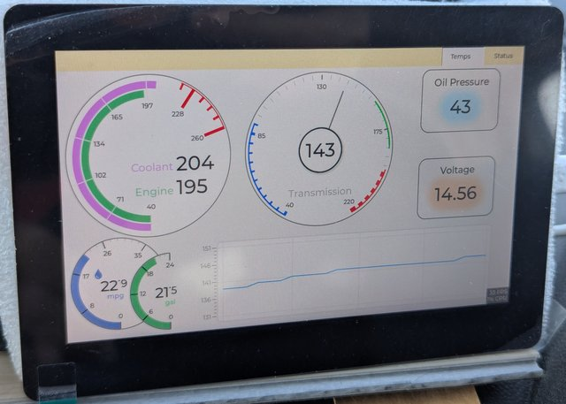

# Promaster OBD monitoring

 
Similar to scanguage, this monitors coolant, engine, and transmission temperatures as well as oil pressure,
voltage, remaining fuel, and rolling mpg over 5 minutes.

It runs on an esp32s3 [waveshare 5 inch touch lcd](https://www.waveshare.com/wiki/ESP32-S3-Touch-LCD-5) and 
communicates with an OBDLink MX+ OBD dongle, through another esp32 acting as  [gateway](https://github.com/ferdy-lw/bt-obd-gw) 
between http, what the esp32s3 uses, and BT Classic which is what the OBDLink requires. 
The esp32s3 does not support BT Classic which necessitated the gateway. If the OBD dongle supported BLE then the esp32s3 could issue the elm327 pids directly.

## Data flows

## Build

### Dev Containers
ESP32 development is done in a dev container based on the esp-idf-svc images.

The UI is designed through [eez studio](https://www.envox.eu/studio/studio-introduction/) using LVGL with
rust bindings. It does not use the rust-lvgl library which is not well maintained, the ui/lvgl C functions are
simply called through unsafe blocks. 

### Build

`cargo build`

### Flash

`espflash flash --monitor target/xtensa-esp32s3-espidf/debug/pm-guage`
