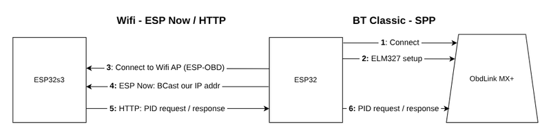

# Promaster OBD monitoring

 
Similar to scanguage, monitor coolant, engine, and transmission temperatures as well as oil pressure,
voltage, remaining fuel, and a rolling mpg over 5 minutes.

It runs on an esp32s3 [waveshare 5 inch touch lcd](https://www.waveshare.com/wiki/ESP32-S3-Touch-LCD-5) and 
communicates with an OBDLink MX+ OBD dongle, through another esp32 acting as  [gateway](https://github.com/ferdy-lw/bt-obd-gw) 
between http, what the esp32s3 uses, and BT Classic which is what the OBDLink requires. 
The esp32s3 does not support BT Classic which necessitated the gateway. If the OBD dongle supported BLE then the esp32s3 could issue the elm327 pids directly.

## Data flows

## Build

### Dev Containers
ESP32 development is done in a podman container based on the esp-idf-svc docker file. I build the image, which can be reused over multiple projects, start it, and use zed ssh remote development.
The issue with zed remote ssh is espflash does not work in the zed project terminal due to usb port forwarding where ssh cannot use the port. 
The flash.sh command, run on the host, execs into the container to do the flashing. One could also use the new zed devcontainer support, but that creates a new image per project. 

The UI is designed in [eez studio](https://www.envox.eu/studio/studio-introduction/) using LVGL 8.
The ui/lvgl C functions are simply called through unsafe blocks. 

### Build

`cargo build`

### Flash

`espflash flash --monitor target/xtensa-esp32s3-espidf/debug/pm-guage`

